<iframe width="560" height="315" src="https://www.youtube.com/embed/mf0bYtyL3Qc?si=XKI2YsCmdkSZB1xY" title="YouTube video player" frameborder="0" allow="accelerometer; autoplay; clipboard-write; encrypted-media; gyroscope; picture-in-picture; web-share" referrerpolicy="strict-origin-when-cross-origin" allowfullscreen></iframe>

# 왜 버전 관리 시스템을 쓰나요?

## 소스코드의 특징

* 없어지면 안됩니다.
* 코드를 수시로 더하고 빼고 바꾸고
* 여럿이 (동시에) 작업
* 언제 누가 (어디서) 무엇을 어떻게 왜 바꿨는가?
* 어떻게 바꿨는가?

## 버전 관리 시스템이 하는 일

* 주로 (텍스트) 파일들을 누가 언제 어떻게 바꿨는지 기록해 보관하고 
* 기록한 내용을 쉽게 확인하고
* 특정 시간(버전)으로 되돌리거나
* 여럿이 함께 동시에 작업하고 공유하기 편리한 시스템

## 가장 간단한(?) 버전관리

* git-기초.PDF
* git-기초_최종본.PDF
* git-기초_진짜최종본.PDF
* git-기초_진짜진짜진짜진짜진짜마지막최종본.PDF

### 간단한 버전관리의 문제

* 어느 것이 "진짜" 최종본인가?
* 누가 언제 뭘 바꿨나 어떻게 파악?
* 뭘 남기고 뭘 지울까?

## VCS 중 왜 git?

* 가볍고 빠르고 효과적
* "분산" 버전 관리 시스템
* 사실상 산업 표준
* 거의 모든 작업을 로컬에서 (오프라인으로) 할 수 있음
* 강력한 브랜치 관리 기능

## "분산" 버전 관리 시스템

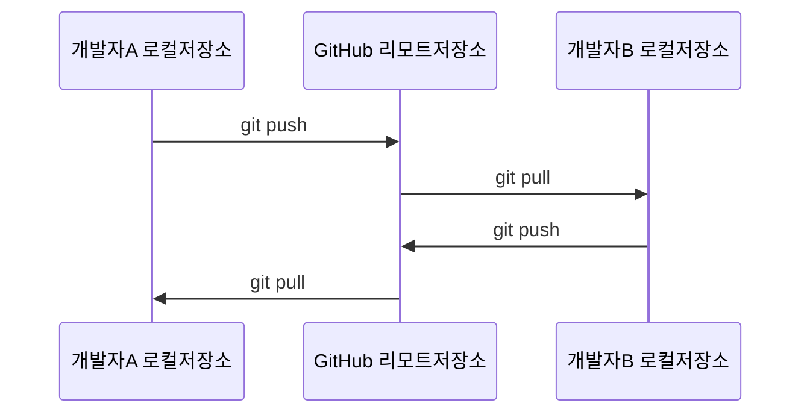

* 각각의 저장소가 완전체

## "분산" 버전관리시스템의 가치

* 네트워크 오프라인 작업 OK
* 로컬에 빠르고 가볍게 작업
* 혼자만의 실험 브랜치 진행
* 다른 사람에게 공유하기 전에 커밋을 정리정돈

# Git 저장소의 세 영역

## 작업 공간 

* Working Tree, Working Directory
* 평소 개발하는 소스코드가 위치한 프로젝트 루트 디렉터리

```sh
➜ tree
.
├── README.md
├── index.html
└── main.css

1 directory, 3 files
```

### 인덱스와 히스토리는..

* 작업 디렉터리 내에 `.git` 디렉터리 안에 잘 관리 보관됨.


## 작업 공간, 인덱스, 그리고 저장소

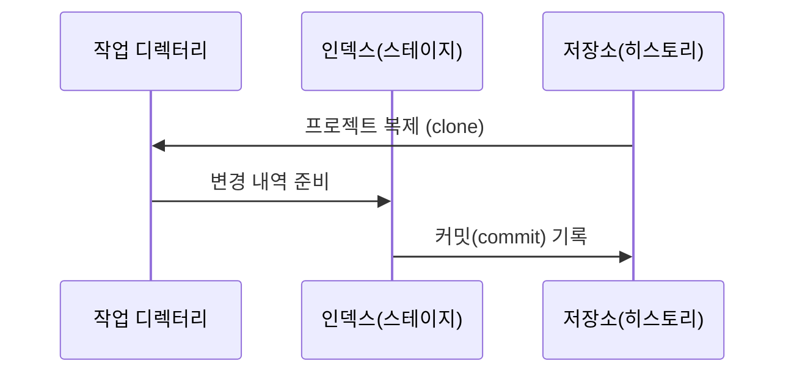

## 커밋 이력이 쌓이는 과정

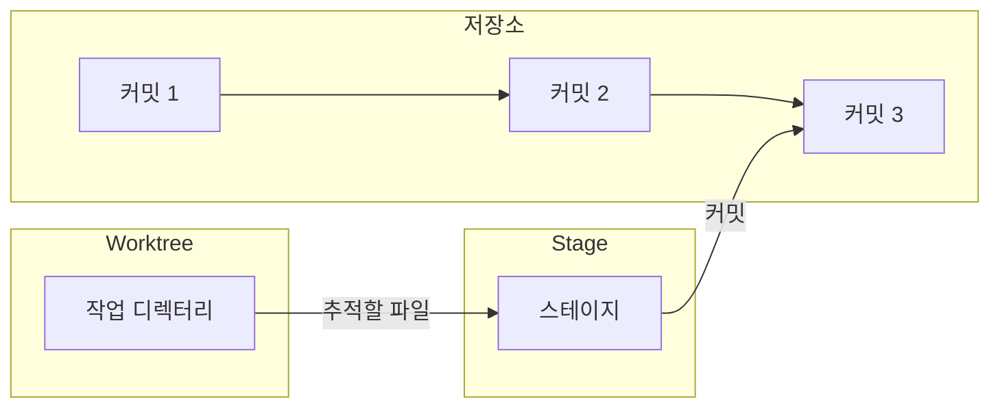

# Git 로컬 저장소 실습

## CLI 활용

* 다양한 Git 전용 GUI 툴 존재.
* 사실상 모든 개발 환경(IDE, 코드에디터)에 git이 기본 포함돼 있다.
* 아무래도 CLI 툴이 오리지널이고, 개념을 익히기 가장 좋다.
 
## 버전 확인

```sh
➜ git version
git version 2.39.3 (Apple Git-146)
```

## 난 누구인가? 설정

```sh
➜ git config --global user.name "Daehyun Kim"
➜ git config --global user.email 이메일@주소
```

* `--global`: 로그온 계정 전체 설정
* `--local`: 현재 저장소 지역 설정

## 실습 디렉터리 준비

```sh
➜ mkdir hello-git
➜ cd hello-git
```

## Git 저장소 초기화

```plain
➜ git init
Initialized empty Git repository in /Users/dhk/hello-git
```

## 초기화 후 상태 확인

```sh
➜ git status
On branch main

No commits yet

nothing to commit (create/copy files and use "git add" to track)
```

> 현재 브랜치는 main이며, 커밋 내역도 없고, 변경 내역도 없습니다.

## 빈 작업 공간에 새 파일 추가

```html
➜ cat > index.html
<html>
<body>
<h1>Hello Git</h1>
</body>
</html>
^D
```

## 새 파일 추가 후 다시 상태 확인

```plain
➜ git status
On branch main
Your branch is up to date with 'origin/main'.

Untracked files:
  (use "git add <file>..." to include in what will be committed)
	index.html

nothing added to commit but untracked files present (use "git add" to track)
```

> git이 아직 모르는 index.html이 있다고 알려줍니다.

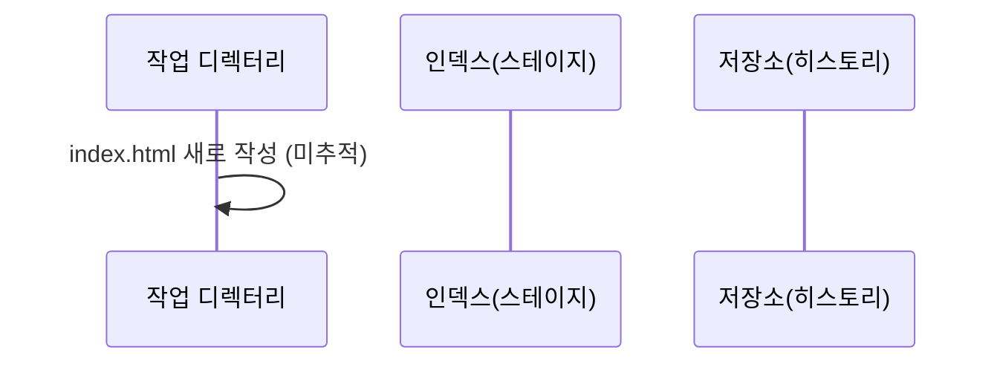

## 인덱스(스테이지) 영역에 추가

```sh
➜ git add index.html
```

> 조용히 스테이지 영역에 들어갑니다.

## 스테이지 된 상태 확인

```plain
➜ git status
git status
On branch main
Your branch is up to date with 'origin/main'.

Changes to be committed:
  (use "git restore --staged <file>..." to unstage)
	new file:   index.html

```

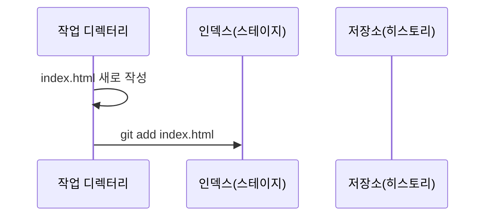

> 새 파일 index.html이 커밋될 준비가 되었습니다.

## 첫 커밋

```plain
➜ git commit -m "인덱스 페이지 추가"
[main 0621585] 인덱스 페이지 추가
 1 file changed, 5 insertions(+)
 create mode 100644 index.html
```

* 한 파일이 바뀌었고, 5줄이 추가됐습니다.

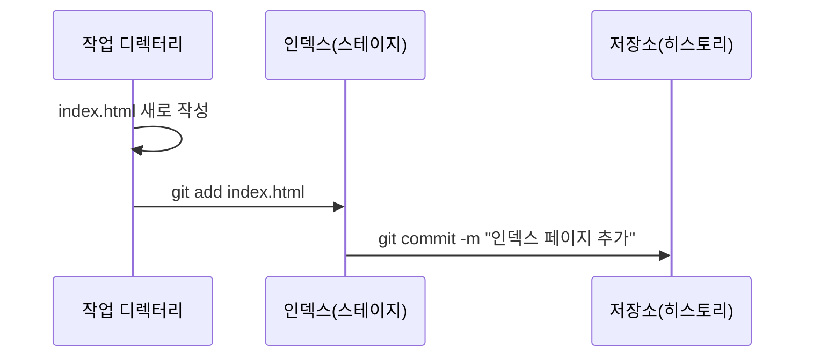

## 커밋 후 상태 확인

```plain
➜ git status
On branch main
nothing to commit, working tree clean
```

> 커밋이 완료됐기에, 현재 작업 디렉터리와 히스토리 영역이 깨끗하게(clean) 일치합니다. 
> git이 모르는 변경 내역이 없습니다.

## 커밋 로그 확인

```plain
➜ git log
commit 0621585ec18b50b991d18a2c578dddb63d4dde84 (HEAD -> main)
Author: Daehyun Kim <이메일@주소>
Date:   Wed May 1 16:11:37 2024 +0900

    인덱스 페이지 추가
```

> 언제 누가 뭐라고 적으며 커밋(commit)했는지 보입니다.

## 커밋 아이디

* 고유 SHA1값 (160bit, 20바이트, 16진수 표현 40글자)
* Git시스템 전반에 ID로 활용
* 0621585ec18b50b991d18a2c578dddb63d4dde84
* 앞 몇 글자만 따서 쓰는 편(앞 6~8자리쯤) -> 0621585

## main.css 파일 하나 더 추가

```css
➜ cat > main.css
h1 {
  background-color: black;
  color: white;
}
^D
```

## index.html에 main.css 추가

```html
➜ cat > index.html
<html>
<head>
  <link rel="stylesheet" type="text/css" href="main.css">
</head>
<body>
<h1>Hello Git</h1>
</body>
</html>
^D
```

## 현재 작업 디렉터리의 상태는?

```plain
➜ git status
On branch main
Changes not staged for commit:
  (use "git add <file>..." to update what will be committed)
  (use "git restore <file>..." to discard changes in working directory)
	modified:   index.html

Untracked files:
  (use "git add <file>..." to include in what will be committed)
	main.css

no changes added to commit (use "git add" and/or "git commit -a")
```

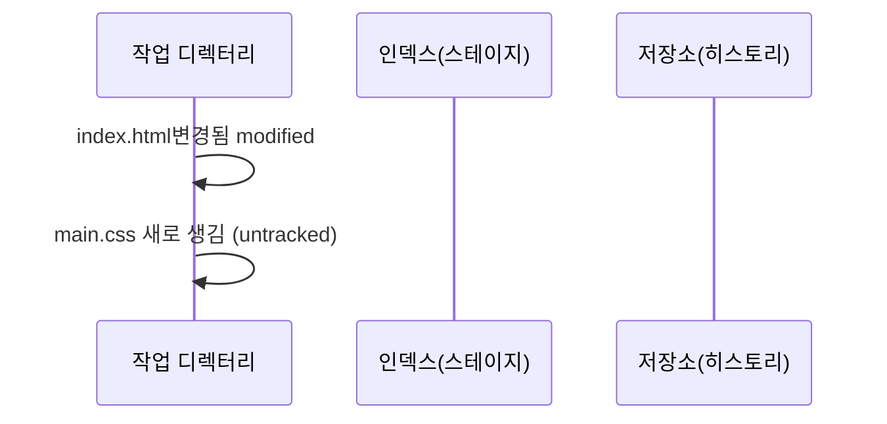

> git이 index.html 변경 내역은 감지했지만, 아직 스테이지 영역에 들어가지는 않았습니다. 
> main.css 파일이 생겼지만, git은 이를 어찌할 줄 모르는 상태입니다.


## 현재 작업 디렉터리가 달라진 점

```sh
➜ git diff
diff --git a/index.html b/index.html
index b7c1897..840984d 100644
```
```diff
--- a/index.html
+++ b/index.html
@@ -1,4 +1,7 @@
 <html>
+<head>
+  <link rel="stylesheet" type="text/css" href="main.css">
+</head>
 <body>
 <h1>Hello Git</h1>
 </body>
```

> 어떤 파일이 라인 단위로 어떻게 바뀌었는지 알 수 있습니다.

## 변경분 스테이지에 올리기!

```sh
➜ git add index.html main.css
```

> 조용히 index.html의 변경분과, 새로운 main.css 파일이 스테이징 영역에 들어갑니다.

## 현재 상태는?

```plain
➜ git status
On branch main
Changes to be committed:
  (use "git restore --staged <file>..." to unstage)
	modified:   index.html
	new file:   main.css
```

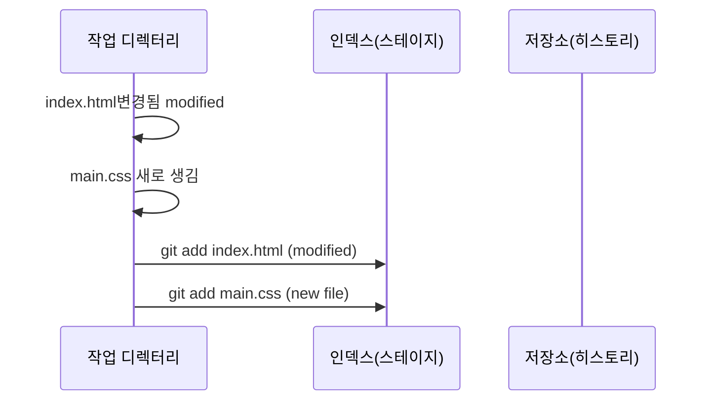

> index.html은 변경됐고, main.css는 새로운 파일입니다.

## 두번째 커밋

```plain
➜ git commit -m "스타일시트 추가"
[main 756741f] 스타일시트 추가
 2 files changed, 7 insertions(+)
 create mode 100644 main.css 
```

> 이번 커밋에는 파일 2개가 바뀌었고, 7줄이 추가됐습니다. 
> main.css는 새로 생성됐군요.


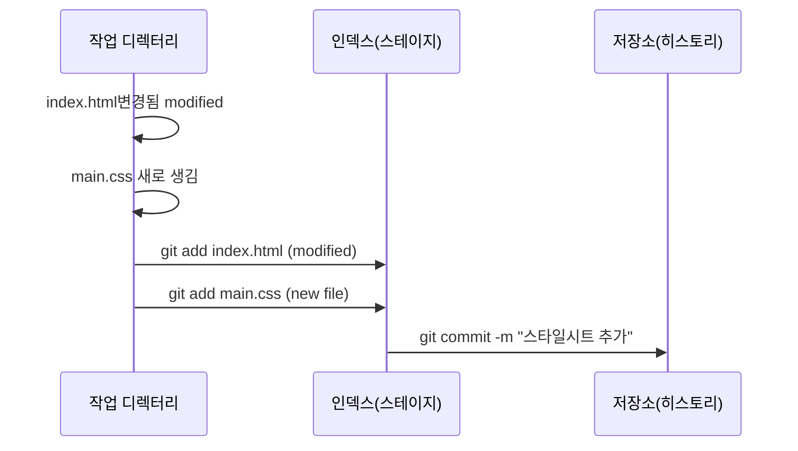

> 무대에 올라간 변경분이 한꺼번에 사진(커밋) 찍힙니다.

## 변경 이력을 봅시다

```plain
➜ git log
commit 756741f76d18d1e1ae7836072341d079e09dabf5 (HEAD -> main)
Author: Daehyun Kim <hatemogi@gmail.com>
Date:   Wed May 1 16:38:17 2024 +0900

    스타일시트 추가

commit 0621585ec18b50b991d18a2c578dddb63d4dde84
Author: Daehyun Kim <hatemogi@gmail.com>
Date:   Wed May 1 16:11:37 2024 +0900

    인덱스 페이지 추가
```

> 커밋 이력 두 건이 있으며, 둘 다 Daehyun Kim이 작업했고, 각각 언제 남겼는지 메시지와 함께 기록이 남아있습니다.

### 커밋 그래프

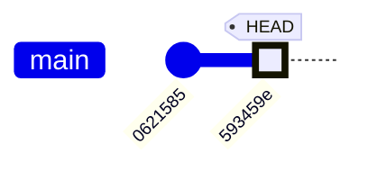

## 현재 확정 최종본과 직전 커밋본 비교

```plain
➜ git diff HEAD^..HEAD
```

```diff
diff --git a/index.html b/index.html
index b7c1897..840984d 100644
--- a/index.html
+++ b/index.html
@@ -1,4 +1,7 @@
 <html>
+<head>
+  <link rel="stylesheet" type="text/css" href="main.css">
+</head>
 <body>
 <h1>Hello Git</h1>
 </body>
diff --git a/main.css b/main.css
new file mode 100644
index 0000000..3c27d62
--- /dev/null
+++ b/main.css
@@ -0,0 +1,4 @@
+h1 {
+  background-color: black;
+  color: white;
+}
```

## 태그를 달아봅니다

```plain
➜ git tag v1.0
```

> 조용히 v1.0 태그가 남습니다.

## 커밋 이력

```plain
➜ git log --oneline
756741f (HEAD -> main, tag: v1.0) 스타일시트 추가
0621585 인덱스 페이지 추가
```

> main의 현재 커밋(756741f)에 v1.0 태그가 덧붙어있습니다. 

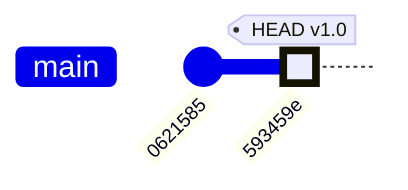

## 특정 커밋 버전으로 되돌리기

```plain
➜ git reset --hard HEAD^
HEAD is now at 0621585 인덱스 페이지 추가
```

> 현재 브랜치의 HEAD를 특정 커밋으로 이동시킵니다.
> 이 경우 HEAD^. 즉 HEAD 직전 커밋으로 이동시키면서 
> --hard옵션으로 작업디렉터리 내용도 바꾸어달라고 요청했습니다.

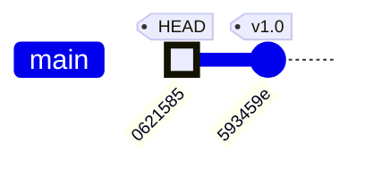

## 현재 저장소 상태 확인

```plain
➜ git log --oneline
0621585 (HEAD -> main) 인덱스 페이지 추가
```

> 어? main.css작업 내역이 사라졌습니다.

## 걱정 말고 되살려 봅니다

```plain
➜ git reset --hard v1.0
HEAD is now at 756741f 스타일시트 추가
```


```plain
➜ git log --oneline
756741f (HEAD -> main, tag: v1.0) 스타일시트 추가
0621585 인덱스 페이지 추가
```

> 깔끔히 되살아 납니다!

## One more thing...

* https://hatemogi.github.io/git-intro-2024/

# 실습한 명령어 요약

| 명령어 | 하는일 |
| --- | --- |
| git init | 로컬 저장소 초기화 |
| git add | 특정 파일 인덱스 영역에 추가 |
| git commit | 인덱스 영역에 있는 변경분 확정(커밋)  |
| git status | 현재 작업공간, 인덱스, 히스토리 상태 개요  |
| git diff | 작업공간과 히스토리의 차이점, 스테이지와 차이점, 커밋간 차이점 등 확인  |
| git log | 커밋 이력 조회  |
| git tag | 특정 커밋에 태그 달기 |
| git reset | HEAD이동. 특정 커밋으로 이동 가능 |


# Git 브랜치 활용예

## develop 브랜치

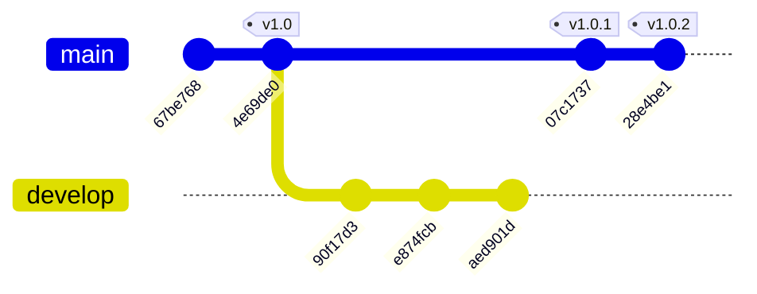

> 두번째 커밋에서 파생(checkout)된 develop 브랜치에 나름의 커밋이 쌓이고 있습니다.

## 브랜치 병합 merge

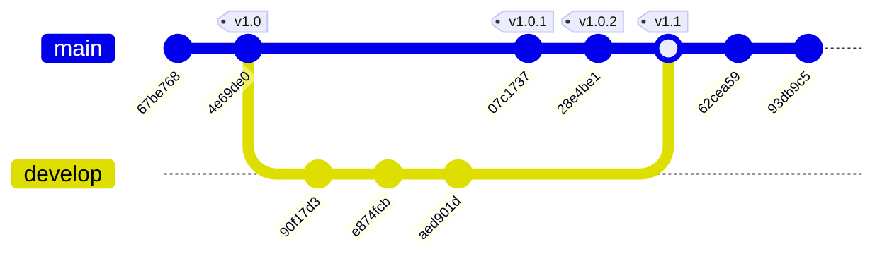

> 기능 개발이 완료되어 main 브랜치에 병합(merge)하였습니다.

## 기능별 브랜치

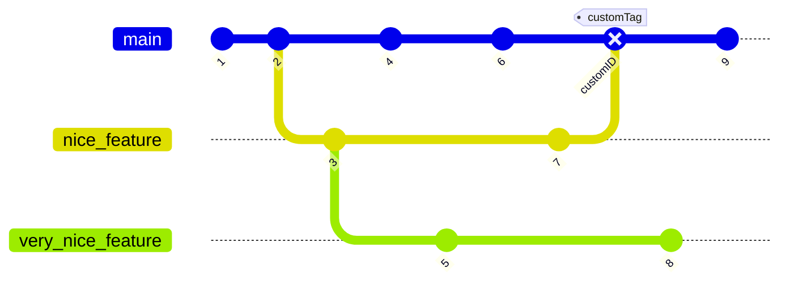

## 더 다양하게 할 수도...

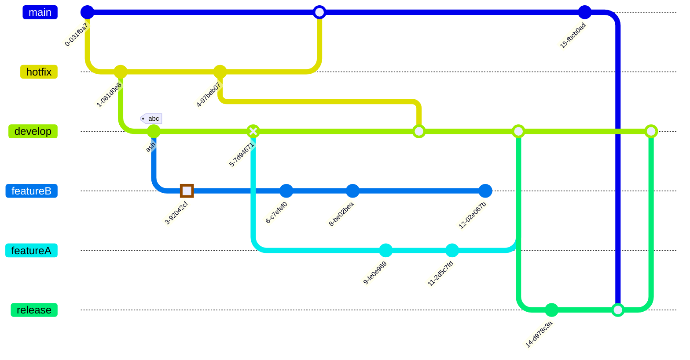

# Git 리모트 저장소 기초

## 리모트 저장소

* 저장소 히스토리가 원격 어딘가에 존재
* GitHub, GitLab, BitBucket 등 서비스 이용.
* 사실상 Microsoft의 GitHub가 원조 & 산업표준

## 리모트저장소 관련 기본 명령어

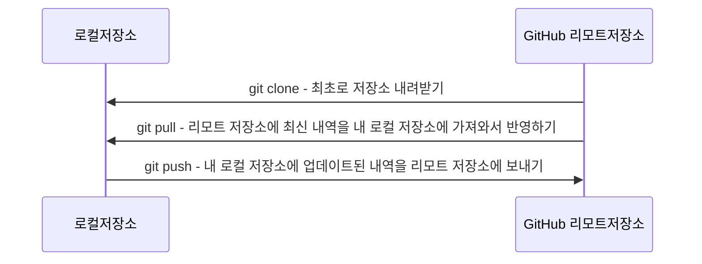

## 작업 공간, 로컬 저장소, 그리고 리모트 저장소

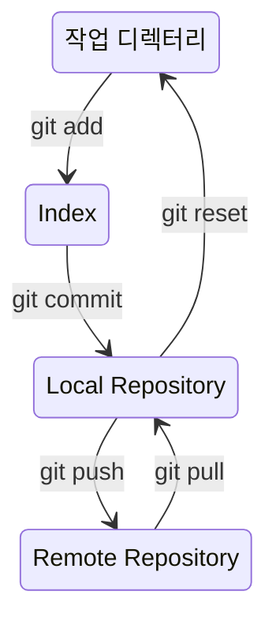

## 개발자ABC, 리모트 저장소

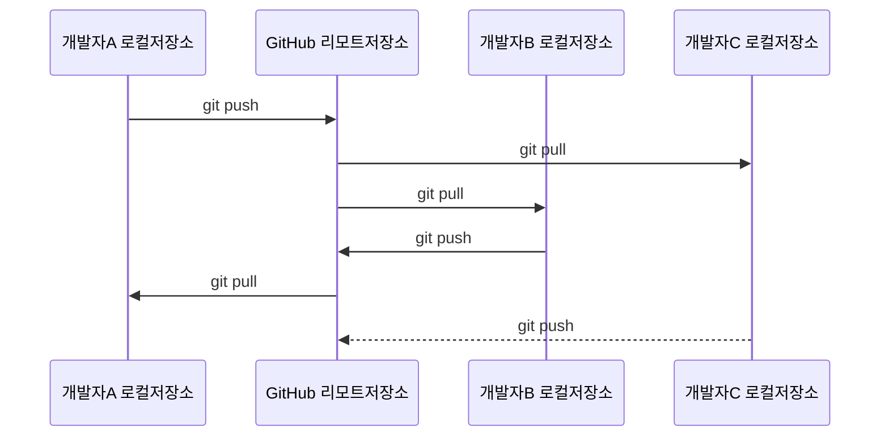

* 보통은 리모트 저장소가 **공동 작업의 기준점** 역할
* 리모트 저장소에 업데이트 된 소스를 기준으로 자동화 테스트, 빌드, 배포 등의 작업을 자동으로 연결해 놓는 편.
* 그럼 누군가 저장소에 push하면, 자동으로 빌드, 테스트, 배포가 상시 진행된다.

# GitHub의 기능

* [git 커밋 이력 조회](https://github.com/hatemogi/git-intro-2024/commits/main/), [코드 브라우징](https://github.com/hatemogi/git-intro-2024/blob/main/index.html)
* [이슈 등록, 커밋 연결](https://github.com/hatemogi/git-intro-2024/issues)
* [프로젝트 관리](https://github.com/hatemogi/git-intro-2024/projects)
* [풀 리퀘스트, 코드 리뷰](https://github.com/hatemogi/git-intro-2024/pulls)
* [GitHub Actions](https://github.com/hatemogi/git-intro-2024/actions): 지속적 통합(Continuous Integration)
* 위키페이지
* [마크다운 문서 작성](https://github.com/hatemogi/git-intro-2024/issues/3)
* [GitHub Pages](https://hatemogi.github.io/git-intro-2024)
* 등등등


# 참고문서

* Git 기초 (영문) - https://docs.github.com/en/get-started/using-git/about-git
* GitHub 시작하기 (한글) - https://docs.github.com/ko/get-started/start-your-journey/hello-world
* https://training.github.com/downloads/github-git-cheat-sheet.pdf


